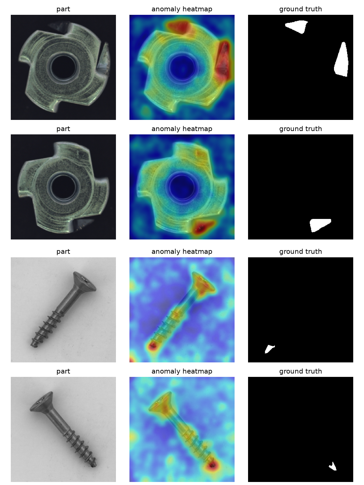

<h1 align="center">Visual Anomaly Detection for Industrial Parts</h1>

<p align="center">
  <em>Find the defect without ever being shown one. Train only on <strong>good</strong>
  images of an industrial part, then flag -- and <strong>localise</strong> -- whatever
  departs from normal. A naive reconstruction autoencoder set head-to-head against an
  embedding <strong>memory bank</strong> (PatchCore-lite), on an AMD GPU via ROCm.</em>
</p>

<p align="center">
  
  
  
  
</p>

<p align="center">
  
</p>

<p align="center">
  <sub>Metal nuts and screws with real defects (left), the model's anomaly heatmap
  (middle), and the ground-truth mask (right). The heat lands on the defect — from a
  backbone that was <strong>never shown a single defect</strong>, scoring by distance
  to remembered good patches.</sub>
</p>

---

## The idea

Real inspection problems -- worn or cracked automotive parts, say -- share an
awkward shape: **good examples are everywhere, and every failure is different.**
Collecting a labelled set of every possible defect is hopeless. So you flip the
problem: learn what *normal* looks like from good parts alone, and treat anything
far from normal as a candidate defect. This is unsupervised **industrial anomaly
detection**, and it's the same family of ideas behind medical screening models
that learn healthy tissue and flag the rest.

There's no open dataset of worn car parts, so this lab uses the field's standard
benchmark -- **[MVTec AD](https://www.mvtec.com/company/research/datasets/mvtec-ad)** --
starting with two metallic categories, `metal_nut` and `screw`, which are the
closest public stand-in for automotive parts and come with **per-pixel defect
masks** so we can score *where* the model looks, not just *whether* it fires.

Two methods, deliberately contrasted:

- **Baseline -- reconstruction autoencoder.** Learn to rebuild good images;
  wherever the rebuild is poor at test time, call it anomalous. Intuitive, and
  instructive precisely because it underperforms.
- **The strong one -- embedding memory bank (PatchCore-lite).** Push every good
  image through a *frozen, pretrained* CNN and store its patch embeddings in a
  memory bank. Score a test patch by its **distance to the nearest normal patch**.
  No weights are trained -- it's *embeddings + nearest-neighbour search*, the same
  machinery as metric learning, now pointed at defects. It also yields a clean
  anomaly **heatmap**.

> **Built to be learned from.** Every module carries a didactic docstring, the
> [`STUDY_GUIDE.md`](STUDY_GUIDE.md) runs a *predict -> run -> check* loop of
> experiments, and [`notebooks/estudo_deteccao_defeito.ipynb`](notebooks/estudo_deteccao_defeito.ipynb)
> is a fill-in-the-blank walkthrough with the `src/` package as the answer key.

## Results

<!-- Measured on an AMD Radeon RX 9060 XT (RDNA4) via torch 2.9.1+rocm6.4. -->

| Category | Method | Image AUROC | Pixel AUROC | PRO | Notes |
|---|---|---|---|---|---|
| metal_nut | Autoencoder (baseline) | 0.341 | 0.729 | 0.362 | max-error score collapses below chance |
| metal_nut | PatchCore-lite | **0.992** | 0.964 | 0.927 | frozen backbone, no training |
| screw | Autoencoder (baseline) | 0.875 | 0.879 | 0.493 | scratches localise poorly (low PRO) |
| screw | PatchCore-lite | **0.920** | 0.990 | 0.954 | frozen backbone, no training |

## Quickstart

```bash
# 1. Environment (Python 3.12 for the torch backend; core math runs on 3.10+).
python3.12 -m venv .venv && source .venv/bin/activate
pip install -e '.[dev]'

# 2. PyTorch + torchvision for your AMD GPU -- from the ROCm index, NOT PyPI.
#    See requirements-torch-rocm.txt for the /tmp and gfx-override caveats.
pip install --index-url https://download.pytorch.org/whl/rocm6.4 torch torchvision

# 3. Data (one MVTec category), fit, evaluate.
python scripts/download_data.py --category metal_nut
python scripts/fit_memory_bank.py --category metal_nut
python scripts/train_autoencoder.py --category metal_nut
python scripts/compare.py --category metal_nut

# 4. Interactive demo.
streamlit run app/streamlit_app.py
```

Tests run without the dataset or a GPU -- they use small synthetic fixtures:

```bash
pytest
```

## Layout

```
src/image_anomaly_lab/   backbones, detectors (autoencoder + memory_bank), evaluation
scripts/                 download, fit, train, compare -- each a small CLI
app/streamlit_app.py     upload -> heatmap overlay + score + pass/fail verdict
notebooks/               fill-in-the-blank study notebook
docs/GUIA_ANOMALIA.md    study diary (Portuguese)
STUDY_GUIDE.md           predict -> run -> check experiments
```

## Next steps

Greedy coreset subsampling, PaDiM (per-position Gaussian + Mahalanobis), the full
15-category sweep, and backbone fine-tuning are left as extensions.

## License

GNU AGPL-3.0-or-later -- see [LICENSE](LICENSE). Copyright (c) 2026 Flavio Manoel
Santos Hemerli.
